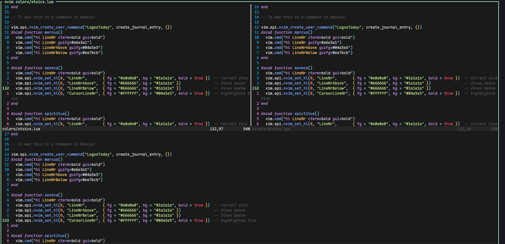

# 🧘 Stoics.nvim

A minimalist Neovim colorscheme inspired by the [guna](https://packagecontrol.io/packages/Guna)  colorscheme and stoicism. 

---
 
## ✨ Features

- 🖤 **Dark monochrome background**
- 🧠 Distinct highlighting for:
  - Functions
  - Classes
  - Variables
  - Operators
  - Punctuation
- 📓 Built-in journal command (`:LogosToday`)
- 🎯 Line number themes inspired by Stoic figures:
  - `:StoicsMarcus` — vivid line numbers
  - `:StoicsSeneca` — gray line numbers with a bright cursor line
  - `:StoicsEpictitus` — fully monochrome

---

## 📦 Installation

Use your favorite plugin manager. Example with [lazy.nvim](https://github.com/folke/lazy.nvim):

```lua
{
  "mtendekuyokwa19/stoics.nvim",
  config = function()
    vim.cmd("colorscheme stoics")
  end
}
```
##  Daily Journal Command

Write to Logos daily.

```lua

:LogosToday
```


